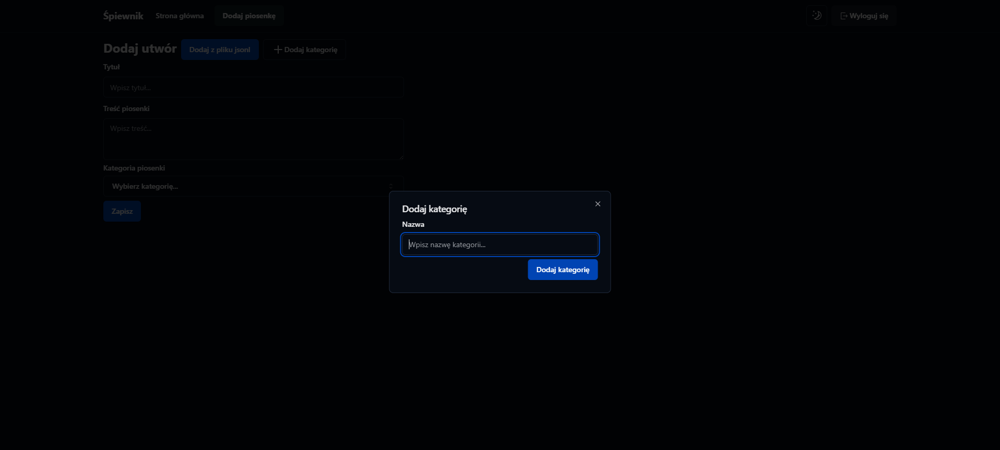

This is a [Next.js](https://nextjs.org/) songbook project.


## Getting Started

Build:

```bash
npm i
#then
cp .env.example .env.local
#and configure that file
```

Running development services in different consoles:

```bash
npm run dev
npx convex dev
```

Open [http://localhost:3000](http://localhost:3000) with your browser to see the result.

## Stack

- Next.js 14 app router
- Convex db
- Clerk auth
